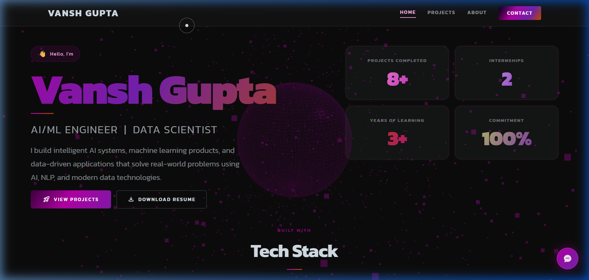
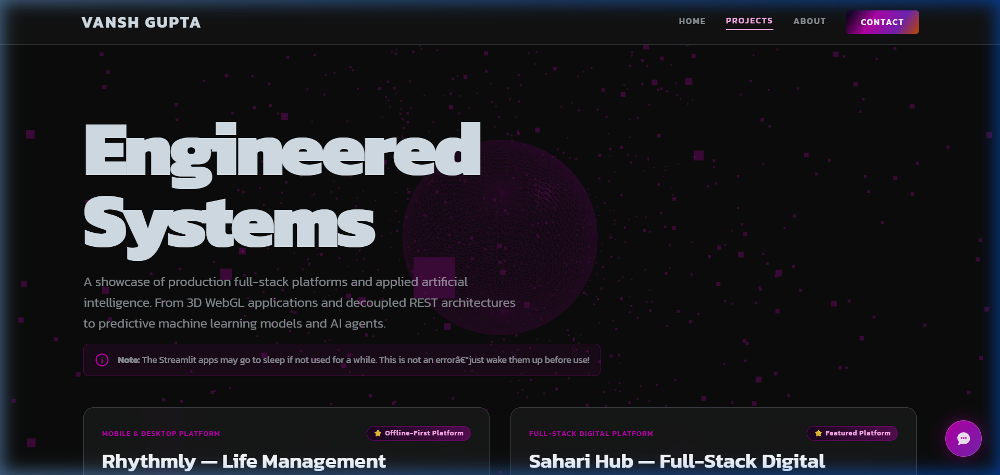
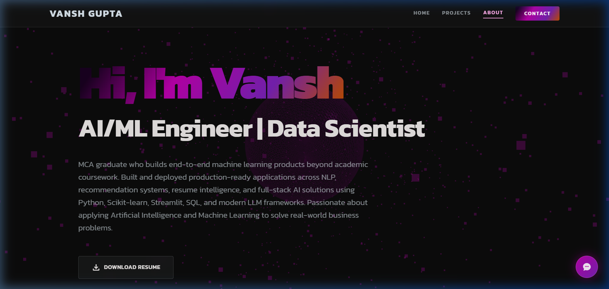
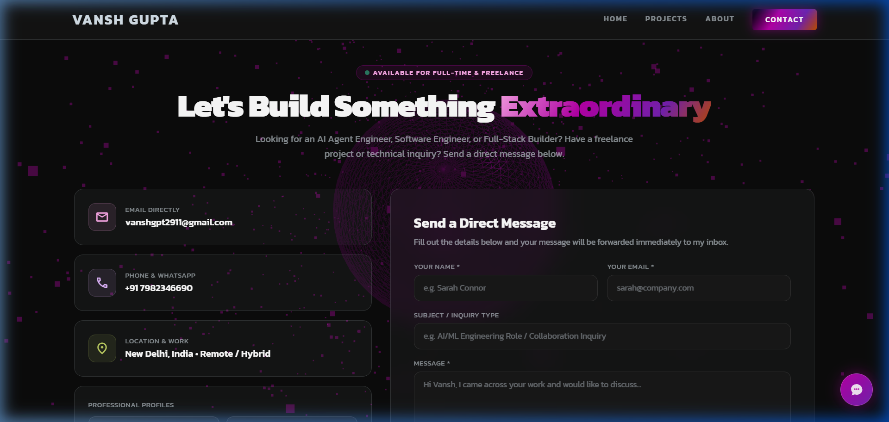

<div align="center">

# 🌌 Vansh Gupta
### **AI/ML Engineer &bull; Full-Stack Developer &bull; Data Scientist**

[](https://vanshgupta-ai.vercel.app/)
[](https://linkedin.com/in/vansh-gupta-ai)
[](https://github.com/vanshg2)
[](mailto:vanshgpt2911@gmail.com)
[](https://docs.google.com/document/d/17CQBw8CP6h2mWhEREGj6s06GiPiPKYyJHTklD0N8B98/export?format=pdf)

<br/>

> **"I build intelligent AI systems, machine learning products, and data-driven full-stack applications that solve real-world problems using AI, NLP, and modern engineering."**

<br/>

[](mailto:vanshgpt2911@gmail.com)
[-7621b0?style=flat-square)](https://vanshgupta-ai.vercel.app/)
[](https://vanshgupta-ai.vercel.app/projects.html)
[](https://vanshgupta-ai.vercel.app/about.html)

<br/>



</div>

---

## 🧭 Overview & Background

I am a **Master of Computer Applications (MCA)** graduate from **Guru Gobind Singh Indraprastha University (GGSIPU)** who builds end-to-end machine learning products and full-stack software beyond academic coursework. 

My engineering focus bridges the gap between raw data, production-grade ML pipelines, and intuitive user experiences. Whether developing **offline-first encrypted mobile architectures**, **production SaaS CRM systems**, **predictive NLP classifiers**, or **interactive analytical dashboards**, I prioritize clean architecture, type safety, and real-world deployment reliability.

### 💡 Core Engineering Philosophy

> *"True AI engineering is not just about training models; it's about **seamless integration**. I believe in a holistic approach where robust data pipelines, efficient model serving, and intuitive user interfaces coalesce to deliver tangible value. Technology should augment human capability, not complicate it."*

---

## 🛠️ Technical Stack & Expertise

<div align="center">

| Category | Technologies & Tools |
| :--- | :--- |
| **Languages** |        |
| **Frontend & Mobile** |         |
| **Backend & Architecture** |       |
| **Databases & Cache** |      |
| **AI, ML & NLP** |         |
| **DevOps & Analytics** |        |

</div>

---

## 🚀 Featured Production Projects & Engineered Systems

<div align="center">
  
</div>

<br/>

### 1. 📱 Rhythmly &mdash; Life Management Platform *(for Women)*
> **Mobile & Desktop Platform &bull; Offline-First Architecture &bull; ⭐ Featured**

An offline-first digital and printable life management application built with **React Native (Expo SDK 51)** and **SQLite**. Features timeblocked daily planning, AES-encrypted women's health tracking, and an on-device PDF template rendering engine.

- **Zero-Cloud Offline Security:** AES field-level encryption with Expo SecureStore and MMKV caching.
- **On-Device PDF Generation:** Generates customized printable daily/weekly planner templates natively.
- **Cross-Platform Delivery:** Runs seamlessly across Android, iOS, Web, and Desktop (Electron).
- **Stack:** `React Native` &bull; `Expo SDK 51` &bull; `SQLite` &bull; `TypeScript` &bull; `Zustand` &bull; `NativeWind` &bull; `MMKV` &bull; `Electron` &bull; `AES-256`
- **Links:** 🌐 [Live Web Demo](https://rhythmy-ecru.vercel.app/)

---

### 2. ⚡ Sahari Hub &mdash; Full-Stack Digital Platform
> **Full-Stack Web Ecosystem &bull; Decoupled REST Architecture &bull; ⭐ Featured**

A modern, full-stack digital platform designed to provide users with a centralized and intuitive ecosystem for accessing services, discovering relevant information, and interacting with platform resources.

- **Decoupled Architecture:** High-performance Next.js frontend communicating via REST with a FastAPI backend.
- **Relational Data Storage:** PostgreSQL data layer replacing fragmented manual records with automated relational pipelines.
- **Stack:** `Next.js` &bull; `React` &bull; `FastAPI` &bull; `PostgreSQL` &bull; `Tailwind CSS` &bull; `TypeScript`
- **Links:** 🌐 [Live Platform Demo](https://sahari-hub-ten.vercel.app/)

---

### 3. 🚗 Velocity Customs CRM
> **SaaS CRM Platform &bull; Financial & Inventory Management &bull; ⭐ Latest Project**

A full-stack, production-ready SaaS built for auto detailing and custom vehicle businesses. Handles end-to-end client invoicing, tax automation, real-time inventory tracking, and financial analytics.

- **Automated Invoicing:** Dynamic tax calculation and exportable client billing receipts.
- **Stock Intelligence:** Low-inventory alerts and component usage logging.
- **Decoupled Cloud Hosting:** Independent frontend (Vercel) and backend microservice (Render) deployment.
- **Stack:** `Next.js` &bull; `FastAPI` &bull; `PostgreSQL` &bull; `Tailwind CSS` &bull; `Python`
- **Links:** 🌐 [Live SaaS Demo](https://detailier-pro-crm.vercel.app/) *(Demo Login: `admin` / `admin123`)*

---

### 4. 💼 AI-Powered Recruitment CRM
> **HR Intelligence &bull; Role-Based Candidate Pipeline &bull; ⭐ Featured**

Comprehensive candidate management CRM featuring secure role-based authentication for 200+ profiles, payment/invoice processing, recruiter modules, and hiring stage analytics.

- **Role-Based Access Control:** Separate administrative and recruiter view permissions.
- **Relational Backend:** Structured database schema implemented in MySQL with SQLAlchemy ORM.
- **Stack:** `Python` &bull; `SQLAlchemy` &bull; `MySQL` &bull; `Streamlit` &bull; `Pandas`
- **Links:** 🌐 [Launch Recruitment CRM](https://recruitement-crm-v2.onrender.com/login) *(Demo Login: `admin` / `admin@123`)*

---

### 5. 🛡️ YouTube Toxic Comment Analyzer
> **Applied NLP &bull; Automated Moderation Pipeline**

An automated comment moderation pipeline that classifies toxic online comments at **~89% accuracy**. Fetches live video comments in real-time using the **YouTube Data API v3**.

- **NLP Pipeline:** Modular TF-IDF vectorization coupled with supervised classification algorithms.
- **Live Streamlit Dashboard:** Instant toxicity scoring and visual sentiment breakdown.
- **Stack:** `Python` &bull; `Scikit-Learn` &bull; `TF-IDF` &bull; `Streamlit` &bull; `YouTube Data API`
- **Links:** 🌐 [Open Analyzer App](https://youtube-toxic-comment-classifier-gszcckrysktdxbsjxyoqch.streamlit.app/)

---

### 6. 📄 Resume Feedback Chatbot & Matcher
> **LLM Prompting &bull; ATS Classification &bull; Resume Intelligence**

An intelligent career evaluation tool combining machine learning classification with LLM prompting. Parses resume PDFs, extracts candidate competencies, predicts optimal job roles, and scores ATS compatibility.

- **Role Prediction:** XGBoost classifier mapping experience profiles against target industry roles.
- **Skill Gap Analysis:** Automated identification of missing qualifications with tailored improvement recommendations.
- **Stack:** `Python` &bull; `XGBoost` &bull; `Streamlit` &bull; `LLM Prompting` &bull; `PyPDF`
- **Links:** 🌐 [Launch Resume Matcher](https://resume-matcher-and-job-finder-j5yb5i8ucx7okgkr2lkckd.streamlit.app/)

---

### 7. 🎬 CineSense &mdash; Semantic Movie Search & Analysis
> **Recommender Systems &bull; Sentiment Analysis &bull; Multi-API Integration**

AI-powered movie discovery platform that delivers content-based recommendations enriched with real-time TMDB details, YouTube trailers, actor cast profiles, and VADER audience review sentiment analytics.

- **Content-Based Similarity:** High-dimensional vector cosine similarity calculated over plot and metadata embeddings.
- **Live Review Sentiment:** Real-time polarity analysis on user reviews using VADER.
- **Stack:** `Python` &bull; `Scikit-Learn` &bull; `VADER` &bull; `Streamlit` &bull; `TMDB API` &bull; `YouTube API`
- **Links:** 🌐 [Launch CineSense](https://movie-recommendation-review-sentiment-analyzer-hsphh9ixpg3dzdf.streamlit.app/)

---

### 8. 📊 Amazon Sales Intelligence Dashboard
> **Business Intelligence &bull; Exploratory Data Analysis &bull; Real-Time KPIs**

Interactive BI dashboard engineered to transform raw e-commerce transaction data into actionable business insights through time-series trend analysis, revenue KPIs, and product category breakdowns.

- **Data Engineering:** Robust preprocessing and exploratory data analysis (EDA) over extensive sales records.
- **Interactive Visuals:** Dynamic Plotly charts and Seaborn statistical visual reports.
- **Stack:** `Python` &bull; `Streamlit` &bull; `Plotly` &bull; `Pandas` &bull; `Seaborn`
- **Links:** 🌐 [Open Analytics Dashboard](https://amazon-sales-report-9s5mcmswvq7zdpphxn5rgs.streamlit.app/)

---

## 💼 Industry Experience & Internships

<div align="center">
  
</div>

<br/>

```
┌─────────────────────────────────────────────────────────────────────────────┐
│ 1. Data Analyst Intern — InnoByte Services                                  │
│    • Engineered scalable data pipelines processing 5TB+ telemetry daily.    │
│    • Implemented predictive maintenance models with PyTorch.                │
│    • Reduced system downtime by 24% through proactive failure detection.    │
└─────────────────────────────────────────────────────────────────────────────┘
┌─────────────────────────────────────────────────────────────────────────────┐
│ 2. Performance Analyst — Viralkey Media                                     │
│    • Built automated SQL & Python data reporting infrastructure.            │
│    • Leveraged Scikit-learn for audience & behavioral user segmentation.    │
│    • Improved marketing and ad targeting efficiency by 18%.                 │
└─────────────────────────────────────────────────────────────────────────────┘
```

---

## 🎓 Education & Credentials

- **Degree:** Master of Computer Applications (**MCA**)
- **Institution:** Guru Gobind Singh Indraprastha University (**GGSIPU**), New Delhi, India
- **Core Focus:** Artificial Intelligence, Machine Learning, Data Structures & Algorithms, Distributed Systems, Software Engineering

---

## 📬 Connect & Collaborate

<div align="center">
  
</div>

<br/>

Whether you are looking for an **AI/ML Engineer**, **Full-Stack Developer**, or **Data Scientist** for full-time roles, or have a freelance system to architect, let's connect:

<div align="center">

[](https://vanshgupta-ai.vercel.app/)
[](https://linkedin.com/in/vansh-gupta-ai)
[](https://github.com/vanshg2)
[](mailto:vanshgpt2911@gmail.com)
[](https://wa.me/917982346690)

<br/>

```
📍 Location: New Delhi, India (Available for Remote / Hybrid / On-Site Worldwide)
⚡ Response Time: Within 24 hours
```

<br/>

<sub>Designed & Engineered by <b>Vansh Gupta</b> &bull; Hosted on <a href="https://vanshgupta-ai.vercel.app/">Vercel</a></sub>

</div>
